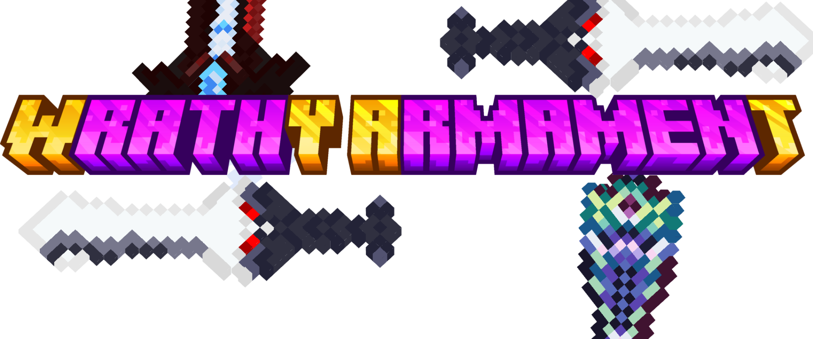

Status: **Stable**

# About:

><h4> Wrathy Armament</h4> legendary weapons bringing Minecraft mod for Forge(NeoForge and Fabric upcoming), 
> oriented to provide weapons from game-world-wide galaxies "to give opportunities for Steve to try them".
> Moreover, Wrathy Armament enhances the gameplay experience by incorporating visual effects, a bespoke player animation and attention to detail of the games from which the weapons are derived.

>- Each weapon, its system of getting and abilities created according to its originals in games they're from. Some from slaying bosses, some from crafting or finding

>- Mod's weapons contains sparkle-tier upgrading system, that improves and unlock new abilities. So try them in use!

The mod is translated into 3 languages:

- English(original) and Ukrainian - by SashaKYotoz
- Polish by Habciak